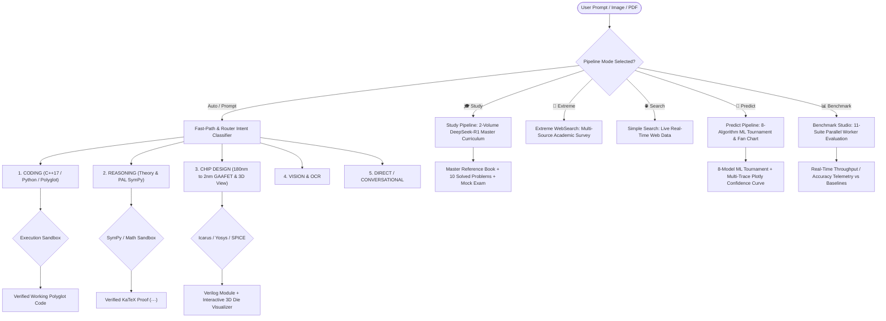

<div align="center">

# 🧠 DeepThink AIOS

### Fully Local Multi-Agent AI Operating System, Semiconductor EDA Studio & Autonomous Research Fleet

*An orchestrated fleet of specialized SLMs/LLMs running on consumer hardware — zero cloud dependencies.*


</div>

---

DeepThink AIOS is an **enterprise-grade, fully local multi-agent AI Operating System** that routes user queries across specialized neural pipelines for software engineering, theoretical mathematical reasoning, machine learning forecasting tournaments, 2-volume university textbook authoring, 3D physical semiconductor layout synthesis (from 180nm planar to 2nm GAAFET), and hardware-accelerated benchmarking — all running locally with dynamic hardware scaling from Intel iGPUs to NVIDIA H100s.

---

### 💻 System Requirements

| Specification | Minimum (Lightweight LLMs) | Recommended (Full Swarm Fleet) |
|---|---|---|
| **System RAM** | **8 GB RAM** *(using 1.5B–3B quants)* | **16 GB – 32 GB RAM** *(for 7B–9B quants)* |
| **GPU VRAM** | Integrated iGPU / 2–4 GB VRAM | 8 GB – 16 GB+ VRAM *(Vulkan / CUDA / Metal)* |
| **Storage** | 10 GB free disk space | 30 GB SSD space for full local GGUF fleet |
| **OS** | Linux (Ubuntu/Debian), macOS (Apple Silicon), Windows 10/11 | Linux / Kaggle Cloud VM / macOS |

---

### ✨ Key Features & Specialized Pipelines

- **🎓 Master 2-Volume Study Engine (`🎓 Study`)** — Pedagogical textbook synthesis powered by **DeepSeek-R1**. Authors 15–20 page master reference books with centered display KaTeX formulas (`$$ ... $$`), multi-dimensional comparison tables, memory mnemonics, a **10-Problem Solved Question Bank**, and a **Standardized Mock Exam Blueprint**. Supports direct PDF/Document ingestion.
- **🔮 Industrial Multi-Domain ML Tournament Engine (`🔮 Predict`)** — High-precision time-series forecasting across Financial Markets, Climate/Weather, Energy & Battery SOH decay, Cloud Telemetry, and Macroeconomics. Competes **8 ML Algorithms** (`HistGradientBoosting`, `RandomForest`, `ExtraTrees`, `SVR`, `Polynomial Ridge`, `Huber`, `ElasticNet`, `ExponentialSmoothing`) inside an isolated sandbox, streaming an interactive **Plotly fan chart** with $\pm 1.96\sigma$ (95%) uncertainty corridors.
- **🔬 Universal Semiconductor EDA & 3D Physical Die Visualizer** — Synthesizes synthesizable Verilog/SystemVerilog HDL and SPICE netlists across all process nodes (180nm Planar to 2nm GAAFET Nanosheets). Renders **5 distinct interactive 3D microarchitectural layouts** (TPU Systolic Arrays, Mobile SoCs, HBM3 3D Stacked DRAM, Out-of-Order CPUs, SIMT GPUs) with real-time component raycasting, hover tooltips, and vertical exploded-view inspection.
- **⚡ Dual-Mode Mathematical Reasoning Engine** — Solves complex calculus, differential geometry, and theoretical physics proofs (e.g. *Schwarzschild Metric*, *Lorentz Transformations*, *Dirac Equation*) with pure 2-stage theoretical KaTeX derivations or Program-Aided Language (PAL) **SymPy/SciPy** sandbox verification.
- **📊 Benchmark Studio & Telemetry Dashboard** — Parallel evaluation across **11 standard suites** (HumanEval, MBPP, GSM8K, MATH, GPQA, AIME, MuSR, MMLU-Pro, SWE-bench Lite, SWE-bench Pro, SearchQA) with real-time scoring vs GPT-4o and Claude 3.5 Sonnet baselines, live throughput ($\text{tok/s}$), and JSON report exports.
- **💻 Modern C++17 / Python Coding Pipeline** — Multi-phase software engineering with logic drafting, actor-critic verification, C++17 shared mutex concurrency (`std::shared_mutex`, lock-free SPSC ring buffers), and automated testbench execution.
- **🌐 100% Keyless Multi-Tier Web Search (`🌐 Search` & `🔬 Extreme`)** — Scrapes live financial quotes, real-time weather, and multi-source academic publications (arXiv, Wikipedia, technical documentation) with deep 5,120+ token synthesis without API keys.
- **⚡ Elastic VRAM Management (EVM) & DMA** — Zero-cost dynamic model hot-swapping between System RAM and GPU VRAM with CPU-to-GPU cache promotion.

---

## 🤖 System Model Fleet

| System Role | Model Name | HuggingFace Repo ID | GGUF Filename & Projector | Quants |
|---|---|---|---|---|
| **Master Router** | **Phi-3.5-Mini** / **Llama-3.2** | `bartowski/Phi-3.5-mini-instruct-GGUF` | `Phi-3.5-mini-instruct-Q6_K.gguf` | Q6_K / Q4_K |
| **Agentic Coder** | **Qwen2.5-Coder / Ornith** | `deepreinforce-ai/Ornith-1.0-9B-GGUF` | `ornith-1.0-9b-Q6_K.gguf` | Q6_K / Q4_K |
| **Reasoning Engine** | **DeepSeek-R1 Distill** | `unsloth/DeepSeek-R1-Distill-Qwen-7B-GGUF` | `DeepSeek-R1-Distill-Qwen-7B-Q6_K.gguf` | Q6_K / Q4_K |
| **Syntax Linter** | **VibeThinker 3B** | `prithivMLmods/VibeThinker-3B-GGUF` | `VibeThinker-3B.Q6_K.gguf` | Q6_K / Q4_K |
| **Vision & OCR** | **Qwen-2.5-VL / Qwen3-VL** | `unsloth/Qwen2.5-VL-7B-Instruct-GGUF` | `Qwen2.5-VL-7B-Instruct-UD-Q6_K_XL.gguf` + `mmproj-BF16.gguf` | Q6_K / Q4_K / Q8_0 |

---

## 🔀 Pipeline Architecture



---

## ⚡ Quick Start

### 1. Local System Startup

```bash
git clone https://github.com/Arpit104147/DeepThink-AIOS.git
cd DeepThink-AIOS

# Launch servers (Backend on :8000, Web UI on :5173)
./start.sh
```

Open **`http://localhost:5173`** in your browser.

---

### 2. Kaggle / Remote Cloud GPU Setup (Continuous Runner)

Paste and run this complete Python script inside a single Kaggle Notebook cell:

```python
# =========================================================================
# 🚀 DEEPTHINK-AIOS: KAGGLE BACKEND + CLOUDFLARE TUNNEL (CONTINUOUS RUNNER)
# =========================================================================

import os, subprocess, time, re, sys

# 1. Clone or Auto-Update Repository
if os.path.exists("/kaggle/working/DeepThink-AIOS"):
    os.chdir("/kaggle/working/DeepThink-AIOS")
    subprocess.run(["git", "pull", "origin", "main"], check=True)
else:
    os.chdir("/kaggle/working")
    subprocess.run(["git", "clone", "https://github.com/Arpit104147/DeepThink-AIOS.git"], check=True)
    os.chdir("/kaggle/working/DeepThink-AIOS")

# 1.5 Install System EDA Chip Design Tools (Icarus Verilog, Yosys, NGSPICE, KLayout)
print("🔬 Installing System EDA Chip Design Tools (iverilog, yosys, ngspice, klayout)...", flush=True)
subprocess.run(["apt-get", "update", "-y", "-q"], check=False)
subprocess.run(["apt-get", "install", "-y", "-q", "iverilog", "yosys", "ngspice", "klayout"], check=False)

# 2. Install dependencies & Pre-compile CUDA llama-cpp-python for Kaggle GPU
print("⚡ Installing requirements & pre-compiling CUDA llama-cpp-python for Kaggle GPU...", flush=True)
subprocess.run([sys.executable, "-m", "pip", "install", "-r", "requirements.txt", "-q"], check=True)

try:
    import torch
    if torch.cuda.is_available():
        print("🔥 Pre-installing CUDA-accelerated llama-cpp-python for Kaggle GPU...", flush=True)
        env = os.environ.copy()
        env["CMAKE_ARGS"] = "-DGGML_CUDA=on"
        env["FORCE_CMAKE"] = "1"
        subprocess.run([
            sys.executable, "-m", "pip", "install",
            "llama-cpp-python", "--force-reinstall", "--no-cache-dir", "-q"
        ], env=env, check=False)
except Exception as e:
    print(f"⚠️ CUDA setup note: {e}")

# 3. Download Cloudflare Tunnel binary
subprocess.run(["wget", "-q", "https://github.com/cloudflare/cloudflared/releases/latest/download/cloudflared-linux-amd64", "-O", "/tmp/cloudflared"], check=True)
subprocess.run(["chmod", "+x", "/tmp/cloudflared"], check=True)

# 4. Launch FastAPI Backend
print("⏳ Launching FastAPI Backend on Port 8000...", flush=True)
backend_proc = subprocess.Popen([sys.executable, "-m", "uvicorn", "backend.app:app", "--host", "0.0.0.0", "--port", "8000"])

# 5. Create Cloudflare Tunnel
print("🌐 Creating Secure Cloudflare Tunnel...", flush=True)
tunnel_proc = subprocess.Popen(
    ["/tmp/cloudflared", "tunnel", "--url", "http://localhost:8000"],
    stdout=subprocess.PIPE,
    stderr=subprocess.STDOUT,
    text=True
)

time.sleep(4)

# 6. Extract & Print Public URL
public_url = None
for line in tunnel_proc.stdout:
    match = re.search(r"https://[a-zA-Z0-9-]+\.trycloudflare\.com", line)
    if match:
        public_url = match.group(0)
        print("\n" + "="*72, flush=True)
        print("🎉 YOUR KAGGLE BACKEND PUBLIC URL:", flush=True)
        print(f"👉 {public_url}", flush=True)
        print("="*72, flush=True)
        print("📌 COPY the URL above and paste it into your local Laptop Frontend!", flush=True)
        print("="*72 + "\n", flush=True)
        break

# 7. Continuous Heartbeat to keep Kaggle alive overnight
start_time = time.time()
print("⚡ Backend is ACTIVE & serving requests continuously...", flush=True)

try:
    while True:
        time.sleep(120)
        elapsed_min = int((time.time() - start_time) // 60)
        print(f"💓 [HEARTBEAT - {elapsed_min}m elapsed] DeepThink-AIOS Backend Running | URL: {public_url}", flush=True)
except KeyboardInterrupt:
    print("Stopping server...", flush=True)
    backend_proc.terminate()
    tunnel_proc.terminate()
```

Copy the printed `https://xxxx.trycloudflare.com` URL, open **`http://localhost:5173`** in your local browser, click **`⚙️ Settings`**, and paste the URL into **Server URL**.

---

## 💻 Tech Stack

- **Backend:** FastAPI, Uvicorn, Python 3.10+, PyTorch, Vulkan SDK, `llama-cpp-python`, ChromaDB, PyPDF, Scikit-Learn, Icarus Verilog, Yosys, NGSPICE, SymPy, NumPy, Pandas
- **Frontend:** React 18, Vite, KaTeX Mathematical Typography, Plotly.js, Three.js / WebGL, Vanilla CSS (Glassmorphism)
- **Hardware Acceleration:** Vulkan Compute (NVIDIA, AMD, Intel iGPU/dGPU), NVIDIA CUDA, Apple Metal, Multi-Core CPU Fallback

---

## 📄 License

MIT License — see [LICENSE](LICENSE) for details.
