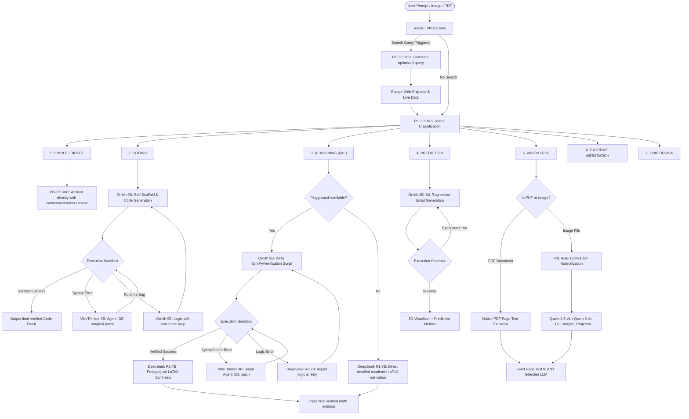

<div align="center">

# 🧠 DeepThink AIOS

### Fully Local Multi-Agent AI Operating System

*An orchestrated fleet of specialized LLMs running on consumer hardware — zero cloud dependencies.*


</div>

---

DeepThink AIOS is a **production-grade, fully offline multi-agent system** that routes user queries through specialized LLM pipelines for coding, reasoning, data science, 3D visualization, PDF document parsing, multimodal vision, and semiconductor chip design — all running locally with dynamic hardware scaling from Intel iGPUs to NVIDIA H100s.

> [!CAUTION]
> This project is in active development. The multi-sandbox architecture and Dynamic Memory Allocator push consumer hardware to its limits.

---

### 💻 System Requirements

| Specification | Minimum (Lightweight LLMs) | Recommended (Full Agent Swarm) |
|---|---|---|
| **System RAM** | **8 GB RAM** *(using 1.5B–3.8B quants)* | **16 GB – 32 GB RAM** *(for 7B–9B quants)* |
| **GPU VRAM** | Integrated iGPU / 2–4 GB VRAM | 8 GB – 16 GB+ VRAM *(Vulkan / CUDA / Metal)* |
| **Storage** | 10 GB free disk space | 30 GB SSD space for full local GGUF fleet |
| **OS** | Linux (Ubuntu/Debian), macOS (Apple Silicon), Windows 10/11 | Linux / Kaggle Cloud VM / macOS |

---

### ✨ Key Features

- **Universal Vulkan GPU Backend** — Universal acceleration on NVIDIA, AMD, and Intel GPUs via Vulkan compute.
- **Model Hub** — Dynamic HuggingFace GGUF model downloader, card library, and custom model role mapping.
- **Dynamic Vision & Multimodal Projector Engine** — Auto-discovers and pairs **ANY** Vision Language GGUF model (`Qwen2.5-VL`, `Qwen3-VL`, `Llava`, `Moondream`) with its corresponding `mmproj*.gguf` projector file.
- **Native PDF Document Extraction for ALL LLMs** — Native page-by-page PDF parser allowing **EVERY MODEL** (both Vision & Non-Vision LLMs like `DeepSeek-R1`, `Ornith`, `VibeThinker`, `Phi-3.5`, `Gemma-4`) to read, analyze, and explain uploaded PDF documents.
- **PIL RGB Pre-Processing Pipeline** — Automatically normalizes images (converts PNG/WEBP/RGBA to clean 3-channel RGB JPEG, max 1024x1024) to eliminate aspect-ratio and channel distortions in CLIP vision encoders.
- **Multi-Turn Conversation Memory** — Preserves recent conversation history (`history`) in `/api/chat` payloads so follow-up prompts (*"give me C code for it"*, *"explain page 2"*) maintain full context without hallucinating.
- **7-Way Intelligent Routing** — Intent-aware pipeline selection across coding, reasoning, prediction, search, 3D viz, PDF/vision, and chip design.
- **Self-Scaffolding Code Generation** — Primary Coder LLM autonomously plans and writes code in a single unified trajectory.
- **AST-Aware Self-Healing** — Surgical patching via Python AST extraction instead of fixed-line windows.
- **Parallel Web Scraping** — ThreadPoolExecutor-based concurrent page fetching (`N×timeout → 1×timeout`).
- **Dual Sandbox Verification** — Polyglot execution across 13 languages with kernel-level isolation.
- **Chip Design EDA Pipeline** — Full Verilog/SPICE synthesis with SkyWater 130nm PDK mapping.
- **Dynamic Memory Allocator (DMA)** — LRU model swapping enabling 7B+ models on 8GB–16GB RAM systems.

---

## 🤖 Default System Model Fleet

| System Role | Model Name | HuggingFace Repo ID | GGUF Filename & Projector | Quants |
|---|---|---|---|---|
| **Master Router** | **Phi-3.5-Mini** | `bartowski/Phi-3.5-mini-instruct-GGUF` | `Phi-3.5-mini-instruct-Q6_K.gguf` | Q6_K / Q4_K |
| **Agentic Coder** | **Ornith 1.0-9B** | `deepreinforce-ai/Ornith-1.0-9B-GGUF` | `ornith-1.0-9b-Q6_K.gguf` | Q6_K / Q4_K |
| **Reasoning Engine** | **DeepSeek-R1-7B** | `unsloth/DeepSeek-R1-Distill-Qwen-7B-GGUF` | `DeepSeek-R1-Distill-Qwen-7B-Q6_K.gguf` | Q6_K / Q4_K |
| **Syntax Linter** | **VibeThinker 3B** | `prithivMLmods/VibeThinker-3B-GGUF` | `VibeThinker-3B.Q6_K.gguf` | Q6_K / Q4_K |
| **Vision & OCR** | **Qwen-2.5-VL-7B** / **Qwen3-VL-2B** | `unsloth/Qwen2.5-VL-7B-Instruct-GGUF` | `Qwen2.5-VL-7B-Instruct-UD-Q6_K_XL.gguf` + `mmproj-BF16.gguf` | Q6_K / Q4_K / Q8_0 |

*Note: Lightweight 1.5B–3B GGUF models (e.g. Qwen-2.5-1.5B, Qwen3-VL-2B, Llama-3.2-1B/3B) can be assigned to any system role for 8 GB RAM systems via Model Hub.*

---

## 🔀 Pipeline Architecture



---

## ⚡ Quick Start

### 1. Local System Startup

```bash
git clone https://github.com/Arpit104147/DeepThink-AIOS.git
cd DeepThink-AIOS

# Launch servers (Backend on :8080, Web UI on :5173)
./start.sh
```

Open **`http://localhost:5173`** in your browser.

---

### 2. Kaggle / Remote Cloud GPU Setup (Continuous Runner)

Paste and run this complete Python script inside a single Kaggle Notebook cell:

```python
# =========================================================================
# 🚀 DEEPTHINK-AIOS: KAGGLE BACKEND + CLOUDFLARE TUNNEL (CONTINUOUS RUNNER)
# =========================================================================

import os, subprocess, time, re, sys

# 1. Clone or Auto-Update Repository
if os.path.exists("/kaggle/working/DeepThink-AIOS"):
    os.chdir("/kaggle/working/DeepThink-AIOS")
    subprocess.run(["git", "pull", "origin", "main"], check=True)
else:
    os.chdir("/kaggle/working")
    subprocess.run(["git", "clone", "https://github.com/Arpit104147/DeepThink-AIOS.git"], check=True)
    os.chdir("/kaggle/working/DeepThink-AIOS")

# 1.5 Install System EDA Chip Design Tools (Icarus Verilog, Yosys, NGSPICE, KLayout)
print("🔬 Installing System EDA Chip Design Tools (iverilog, yosys, ngspice, klayout)...", flush=True)
subprocess.run(["apt-get", "update", "-y", "-q"], check=False)
subprocess.run(["apt-get", "install", "-y", "-q", "iverilog", "yosys", "ngspice", "klayout"], check=False)

# 2. Install dependencies & Pre-compile CUDA llama-cpp-python for Kaggle GPU
print("⚡ Installing requirements & pre-compiling CUDA llama-cpp-python for Kaggle GPU...", flush=True)
subprocess.run([sys.executable, "-m", "pip", "install", "-r", "requirements.txt", "-q"], check=True)

try:
    import torch
    if torch.cuda.is_available():
        print("🔥 Pre-installing CUDA-accelerated llama-cpp-python for Kaggle GPU...", flush=True)
        env = os.environ.copy()
        env["CMAKE_ARGS"] = "-DGGML_CUDA=on"
        env["FORCE_CMAKE"] = "1"
        subprocess.run([
            sys.executable, "-m", "pip", "install",
            "llama-cpp-python", "--force-reinstall", "--no-cache-dir", "-q"
        ], env=env, check=False)
except Exception as e:
    print(f"⚠️ CUDA setup note: {e}")

# 3. Download Cloudflare Tunnel binary
subprocess.run(["wget", "-q", "https://github.com/cloudflare/cloudflared/releases/latest/download/cloudflared-linux-amd64", "-O", "/tmp/cloudflared"], check=True)
subprocess.run(["chmod", "+x", "/tmp/cloudflared"], check=True)

# 4. Launch FastAPI Backend
print("⏳ Launching FastAPI Backend on Port 8000...", flush=True)
backend_proc = subprocess.Popen([sys.executable, "-m", "uvicorn", "backend.app:app", "--host", "0.0.0.0", "--port", "8000"])

# 5. Create Cloudflare Tunnel
print("🌐 Creating Secure Cloudflare Tunnel...", flush=True)
tunnel_proc = subprocess.Popen(
    ["/tmp/cloudflared", "tunnel", "--url", "http://localhost:8000"],
    stdout=subprocess.PIPE,
    stderr=subprocess.STDOUT,
    text=True
)

time.sleep(4)

# 6. Extract & Print Public URL
public_url = None
for line in tunnel_proc.stdout:
    match = re.search(r"https://[a-zA-Z0-9-]+\.trycloudflare\.com", line)
    if match:
        public_url = match.group(0)
        print("\n" + "="*72, flush=True)
        print("🎉 YOUR KAGGLE BACKEND PUBLIC URL:", flush=True)
        print(f"👉 {public_url}", flush=True)
        print("="*72, flush=True)
        print("📌 COPY the URL above and paste it into your local Laptop Frontend!", flush=True)
        print("="*72 + "\n", flush=True)
        break

# 7. Continuous Heartbeat to keep Kaggle alive overnight
start_time = time.time()
print("⚡ Backend is ACTIVE & serving requests continuously...", flush=True)

try:
    while True:
        time.sleep(120)
        elapsed_min = int((time.time() - start_time) // 60)
        print(f"💓 [HEARTBEAT - {elapsed_min}m elapsed] DeepThink-AIOS Backend Running | URL: {public_url}", flush=True)
except KeyboardInterrupt:
    print("Stopping server...", flush=True)
    backend_proc.terminate()
    tunnel_proc.terminate()
```

Copy the printed `https://xxxx.trycloudflare.com` URL, open **`http://localhost:5173`** in your local browser, click **`⚙️ Settings`**, and paste the URL into **Server URL**.

---

## 💻 Tech Stack

- **Backend:** FastAPI, Uvicorn, Python 3.10+, PyTorch, Vulkan SDK, `llama-cpp-python`, ChromaDB, PyPDF
- **Frontend:** React 18, Vite, Vanilla CSS (Glassmorphism), Google Fonts
- **Hardware Support:** Vulkan Compute (NVIDIA, AMD, Intel iGPU/dGPU), CPU Fallback

---

## 📄 License

MIT License — see [LICENSE](LICENSE) for details.
